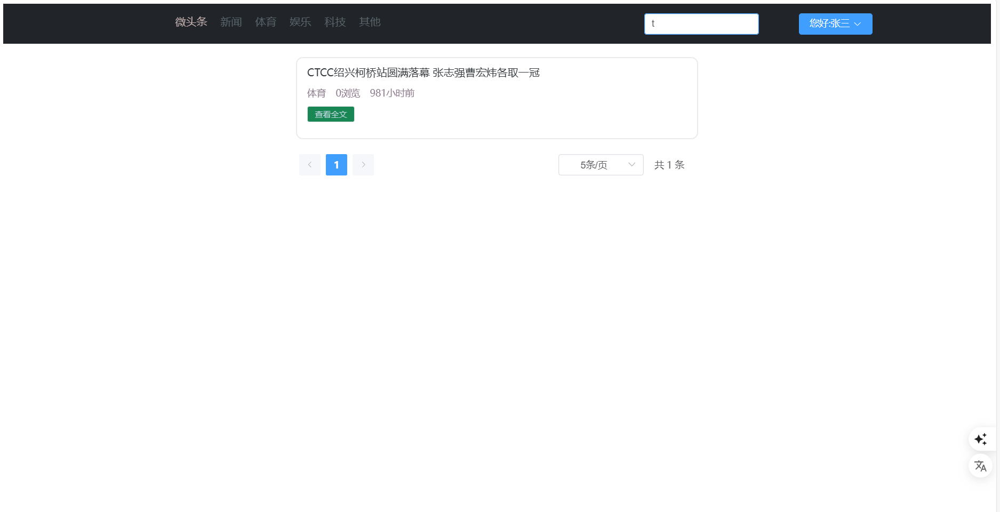
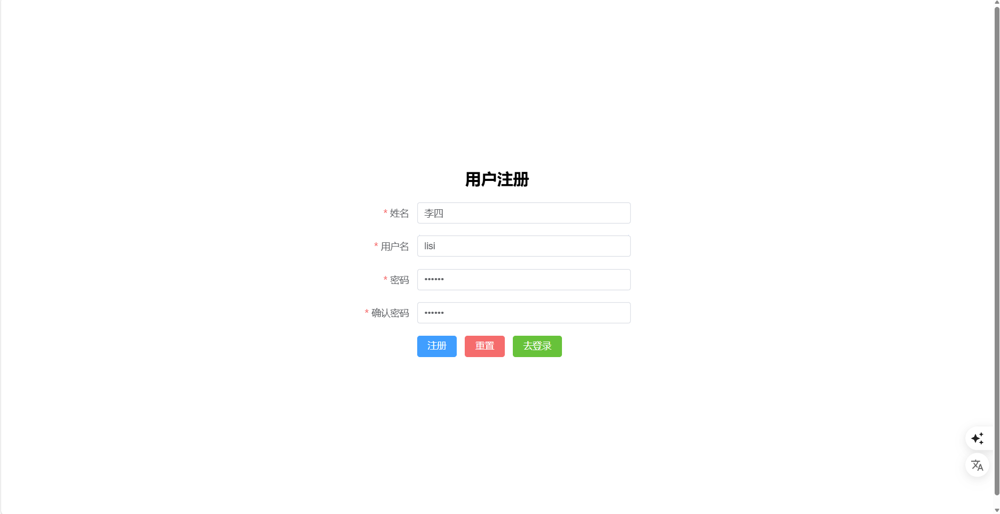
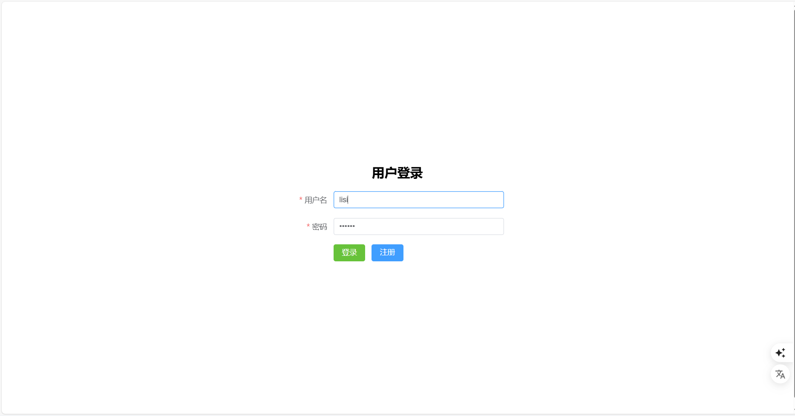
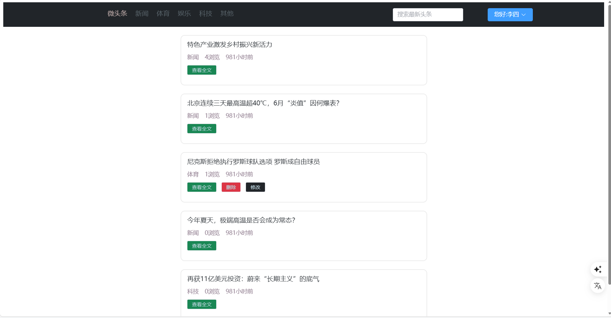
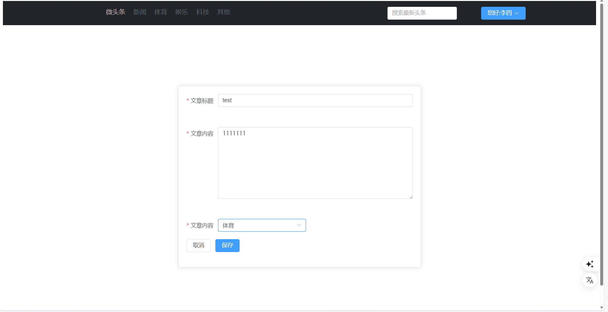
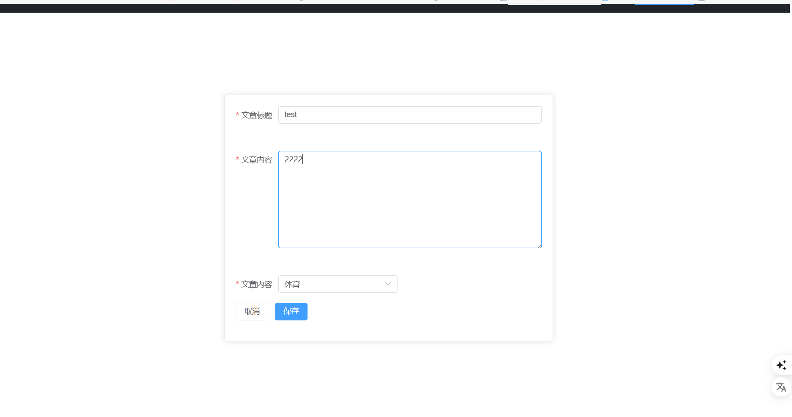

# 微头条 - 新闻发布和浏览平台

> 本项目为学习项目，跟随【尚硅谷】海阳老师的JavaWeb课程完成，用于学习和实践前后端开发技术。

## 项目简介

微头条是一个简易的新闻发布和浏览平台，主要功能包括用户注册登录、新闻发布、浏览、搜索和权限管理。

### 主要功能

#### 用户功能
- **注册功能** - 新用户账号注册
- **登录功能** - 用户登录验证

#### 头条新闻
- **新闻分页浏览** - 支持新闻列表分页显示
- **关键字搜索** - 通过标题关键字搜索新闻
- **新闻详情查看** - 查看单条新闻的完整内容
- **新闻修改和删除** - 对新闻内容进行编辑和删除操作

#### 权限控制
- **用户权限管理** - 用户只能修改和删除自己发布的头条新闻

## 技术栈

### 前端技术栈
- **ES6** - 基础JavaScript语法
- **Node.js** - 运行环境
- **npm** - 项目依赖管理工具
- **Vite** - 项目构建工具
- **Vue3** - 项目数据渲染框架
- **Axios** - 前后端数据交互
- **Router** - 页面跳转
- **Pinia** - 用户数据存储
- **LocalStorage** - 用户校验token存储
- **Element-Plus** - UI组件库

### 后端技术栈
- **Java** - 开发语言 (JDK 17)
- **Tomcat** - 服务容器 (版本 10.1.43)
- **MySQL 8** - 数据存储
- **Servlet** - 控制层实现前后端数据交互
- **JDBC** - 数据CRUD操作
- **Druid** - 数据源连接池
- **MD5** - 用户密码加密
- **JWT** - token生成和校验
- **Jackson** - JSON转换
- **Filter** - 用户登录校验和跨域处理
- **Lombok** - 实体类简化处理

## 环境要求

- JDK 17+
- MySQL 8.0+
- Tomcat 10.1.7+
- Node.js 16+

## 功能展示

### 1. 头条首页与信息搜索

- 展示所有用户发布的头条新闻
- 支持通过标题关键字搜索相关新闻
- 新闻列表分页显示

### 2. 用户注册功能

- 新用户账号注册
- 表单验证确保数据完整性
- 密码加密存储保障安全

### 3. 用户登录功能

- 已注册用户登录验证
- JWT token生成与验证
- 登录状态持久化

### 4. 权限控制功能

- 用户只能操作自己发布的新闻
- 未登录用户无法发布和编辑新闻
- 基于用户角色的访问控制

### 5. 发布头条功能

- 登录用户可发布新头条
- 支持富文本编辑
- 实时预览功能

### 6. 修改头条功能
<table>
  <tr>
    <td width="50%">
      
      
编辑界面

    </td>
    <td width="50%">
      
      
保存成功提示

    </td>
  </tr>
</table>
- 用户可编辑自己发布的头条
- 保留原始发布时间
- 更新修改时间戳

### 7. 删除头条功能

- 用户可删除自己发布的头条
- 删除前确认提示
- 实时更新新闻列表

### 后端运行
1. 下载top_news.sql文件并执行到mysql数据库
2. 配置数据库连接信息
3. 部署到Tomcat服务器
4. 启动Tomcat服务

### 前端运行
1. 安装依赖：`npm install`
2. 启动开发服务器：`npm run dev`
3. 构建生产版本：`npm run build`

## 注意事项

- 本项目为学习用途，遵循尚硅谷海阳老师的教学指导
- 数据库配置文件请根据实际环境进行修改
- 生产环境部署时请妥善保管敏感信息

## 致谢

感谢【尚硅谷】海阳老师的详细教学和指导，通过这个项目学习了完整的JavaWeb开发流程。

---

*如有问题或建议，欢迎交流讨论。*
